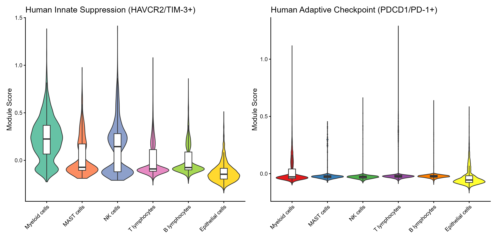

# Immune Checkpoint Suppression in Lung Adenocarcinoma: Single-Cell Transcriptomics Reveals a Myeloid-Mediated Paracrine Network

## Project Overview
Immune evasion in lung adenocarcinoma (LUAD) is a major reason immunotherapy fails. This project leverages single-cell RNA sequencing (scRNA-seq) to deconstruct the tumor microenvironment (TME) of early-stage LUAD, moving beyond single-marker analyses to uncover a systems-level paracrine network of immune suppression.

**Abstract submitted to the 3rd International Congress of Cancer Genomics 2026 (CGC 2026).**

## Biological Key Findings
1. **Compartmentalization:** The innate suppression module (anchored by *HAVCR2*) is exclusively enriched in myeloid cells, while adaptive checkpoints (*PDCD1*, *CTLA4*) are restricted to T lymphocytes.
2. **Immuno-Metabolic Coupling:** Exhausted T cells exhibit a severe collapse of oxidative phosphorylation, alongside a strong positive correlation between the PD-1 signaling axis and glycolysis (Pearson R = 0.172, P < 10⁻⁸⁰).
3. **Outsourcing Suppression:** Cell-cell communication modeling reveals that malignant cells outsource T cell suppression to hijacked myeloid populations (via the TIM-3/Galectin-9 and CTLA-4/CD86 axes) rather than acting on T cells directly.

## Computational Highlights & Troubleshooting
Working with clinical scRNA-seq data often introduces massive computational bottlenecks. This pipeline demonstrates robust big-data handling:
* **Memory Optimization:** Bypassed a 46GB RAM overallocation crash by implementing pre-coercion memory-safe subsetting on a dense matrix of >200,000 cells.
* **Sparse Matrix Conversion:** Successfully extracted and converted a representative subset of 35,000 clinically relevant cells into a highly efficient `dgCMatrix` format.
* **Automated Data Retrieval:** Integrated the `GEOquery` package for programmatic fetching of metadata from the NIH servers to ensure full end-to-end reproducibility.

## Visualizations
*Here is the spatial compartmentalization of immune checkpoints across the TME:*

*(Note: Ensure you upload your PNG file to the results folder so this link works)*

## Reproducibility
To replicate this analysis, run the master script located in the `scripts/` directory. The script automatically fetches the required files from GEO (GSE131907), processes the data, scores modules, and outputs the final interaction tables and high-resolution plots.
